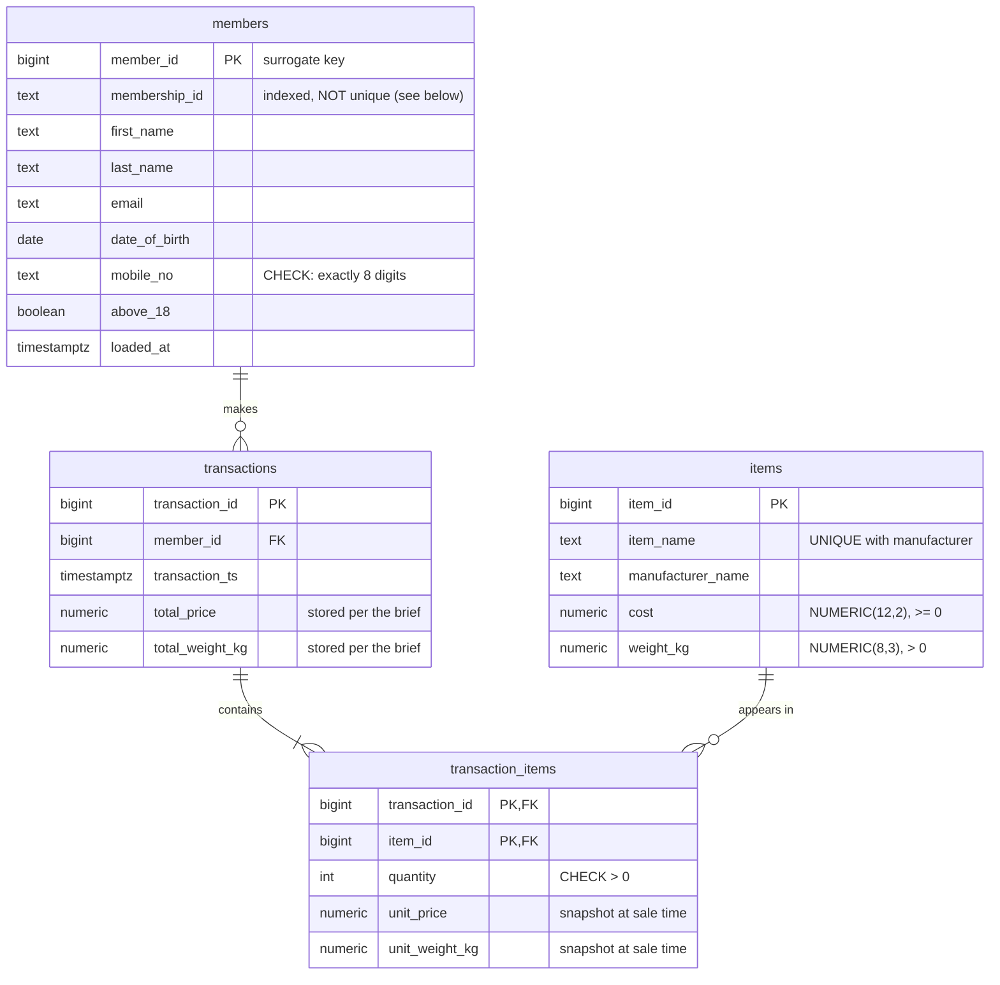

# Section 2: Databases — PostgreSQL Sales Database

A PostgreSQL database, stood up via Docker, that (a) stores the successful
membership applications produced by the section 1 pipeline and (b) holds the
e-commerce company's sales transactions for analyst querying.

## Folder layout

```
section2/
├── Dockerfile                  # postgres:16 with the DDL baked into the init mechanism
├── docker-compose.yml          # one-command run with healthcheck + persistent volume
├── ddl/
│   ├── 01_schema.sql           # tables, constraints, indexes
│   ├── 02_load_members.sh      # loads section 1 successful applications into members
│   └── 03_seed_sales_sample.sql# sample catalogue + transactions for the analyst queries
├── data/
│   └── applications_successful.csv  # section 1 pipeline output (the storage leg)
├── queries/
│   ├── 01_top_10_members_by_spending.sql
│   └── 02_top_3_frequent_items.sql
├── test_database.sh            # integration test (no Docker needed, see Testing)
└── README.md
```

## Running it

```bash
cd section2
docker compose up --build
# then, from another shell:
docker exec -it section2-sales-db psql -U ecommerce -d ecommerce \
    -f /docker-entrypoint-initdb.d/../queries/...   # or \i the query files
```

Or with plain Docker:

```bash
docker build -t section2-sales-db .
docker run -d -p 5432:5432 -e POSTGRES_PASSWORD=ecommerce-dev-password section2-sales-db
psql -h localhost -U ecommerce -d ecommerce -f queries/01_top_10_members_by_spending.sql
```

The official `postgres` image executes everything in
`/docker-entrypoint-initdb.d/` (in lexical order) the first time it starts
with an empty data directory. The Dockerfile copies the `ddl/` scripts and
the `data/` CSV there, so the container comes up with the schema applied,
the 526 successful applications loaded, and the sample sales data seeded —
no manual steps. Note that init scripts do **not** re-run when the compose
volume already holds data; `docker compose down -v` resets it.

## The application pipeline leg

Section 1's pipeline already determines successful/unsuccessful applications
and mints membership IDs. Section 2 provides the **storage and reference
location** for the successful ones: the `members` table.
`ddl/02_load_members.sh` performs the initial bulk load via `\copy` at
container init; subsequent hourly drops are loaded with the same one-liner
pointed at each new file:

```bash
psql -h <host> -U ecommerce -d ecommerce -c "\copy members (membership_id,
  first_name, last_name, email, date_of_birth, mobile_no, above_18)
  FROM 'applications_successful_<stamp>.csv' WITH (FORMAT csv, HEADER true)"
```

## Schema design



### Design decisions

- **Surrogate key for members.** The section 1 membership ID
  (`<last_name>_<first 5 hex chars of sha256(birthday)>`) is not unique:
  two applicants sharing a last name and birthday collide, and the provided
  datasets already contain one such pair (`Williamson_2b72a`). `member_id`
  is therefore the primary key; `membership_id` stays as the indexed
  business identifier analysts query by. Transactions reference
  `member_id`, so colliding members keep separate purchase histories.
- **Bridge table for baskets.** A transaction contains many items and an
  item appears in many transactions — `transaction_items` resolves the
  many-to-many, one row per (transaction, item) with a quantity.
- **Price/weight snapshots on line items.** Catalogue cost and weight
  change over time; `unit_price`/`unit_weight_kg` record what was actually
  paid and shipped at sale time, so historical transactions are immune to
  catalogue updates.
- **Stored totals on transactions.** The brief specifies each transaction
  carries its total price and weight, so they are stored (denormalised for
  cheap reads) rather than derived per query. The trade-off is drift risk;
  the seed loader computes totals from the line items, and the integration
  test asserts the two never disagree. In production a trigger or
  generated-on-write pattern would enforce this.
- **`NUMERIC` for money and weights, never `FLOAT`.** Binary floats cannot
  represent values like 0.10 exactly; financial arithmetic must be exact.
- **Indexes follow the access paths.** FK columns
  (`transactions.member_id`, `transaction_items.item_id`) for the joins in
  the analyst queries, `transactions.transaction_ts` for time-windowed
  analytics, `members.membership_id` for business-ID lookups.

## Analyst queries

Both live under `queries/` with commented variants.

1. **Top 10 members by spending** — sums stored transaction totals per
   member, grouped by surrogate key so ID collisions don't merge two
   people's spending. A `DENSE_RANK()` variant is included for analysts who
   want ties at the cutoff included rather than arbitrarily truncated.
2. **Top 3 most frequently bought items** — "frequently" is read as total
   units sold (`SUM(quantity)`); the alternative reading (number of
   transactions containing the item, `COUNT(DISTINCT transaction_id)`) is
   included as a variant. State your metric — the two can rank differently.

## Testing

```bash
./test_database.sh
```

The integration test needs no Docker: it stands up a throwaway local
PostgreSQL (via `initdb`/`pg_ctl`, both ship with any Postgres install),
applies the same scripts the Docker image applies, and asserts:

- all 526 successful applications load into `members`
- the colliding membership ID is stored as two distinct members
- stored transaction totals agree with their line items on every row
- the CHECK constraint rejects malformed mobile numbers and the FK rejects
  orphan line items
- both analyst queries return the expected winners (hand-computed from the
  seed data: `Smith_c7677` at 653.90 total spend; Wireless Mouse at 6 units)

Current result: **11 passed, 0 failed** (verified against PostgreSQL 17;
the image pins `postgres:16` and the DDL uses no version-specific features).

The Docker image itself has also been verified end-to-end: `docker build`
followed by `docker run` brings the container up with all init scripts
applied (526 members loaded, sample sales seeded) and both analyst queries
returning the same results as the local test.

## Assumptions

- The sample catalogue and transactions in `03_seed_sales_sample.sql` are
  illustrative (the brief provides no sales data); membership IDs in the
  seed are real section 1 outputs. Remove that file from `ddl/` to stand up
  an empty sales database.
- Credentials in `docker-compose.yml` are development defaults; real
  deployments supply secrets via an env file or secret store.
- `members` mirrors the section 1 output columns as the reference store;
  member lifecycle (status changes, deduplication review of colliding IDs)
  is out of scope for this section.
