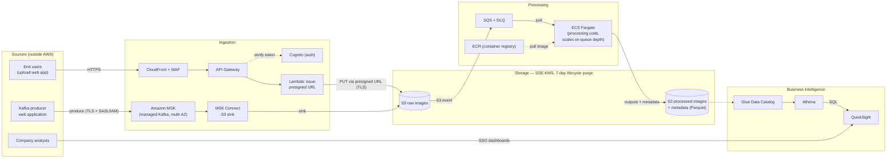

# Section 3, Design 2: Cloud Architecture — Image Processing Platform

End-to-end AWS architecture for a company whose main business is
processing images. The diagram is provided as `architecture.drawio`
(open with [draw.io](https://app.diagrams.net)); the mermaid view below
mirrors it so the design is reviewable directly on GitHub.

Cross-cutting (applies to every component): IAM Identity Center (SSO) +
least-privilege IAM roles, KMS encryption, CloudTrail/GuardDuty/Config
auditing, CloudWatch observability, and Terraform + CI/CD for all
infrastructure and processing-script changes.

## End-to-end flow

1. **User uploads.** Users hit the upload API through CloudFront (TLS,
   edge caching) fronted by AWS WAF (rate limiting, common exploit
   blocking). API Gateway authenticates the caller against Cognito and
   invokes a small Lambda that validates the request (type, size) and
   returns a **presigned S3 URL**. The client PUTs the image straight to
   the raw bucket — image bytes never flow through the API tier, so a
   1 MB request and a 50 MB image cost the same compute.
2. **Kafka uploads.** The second web application produces image events to
   **Amazon MSK** — Kafka as the brief requires, with the company's
   engineers managing topics, partitions, consumers and connectors, while
   AWS handles broker provisioning, patching, and multi-AZ replication. An
   **MSK Connect S3 sink connector** lands the images in the same raw
   bucket, so both ingestion paths converge on one storage location and
   one downstream pipeline.
3. **Processing.** Every object created in the raw bucket emits an **S3
   event notification into SQS**. The engineers' existing processing code
   runs as containers on **ECS Fargate**, pulled from **ECR**, polling the
   queue. The service autoscales on queue depth (including to zero
   overnight). Failed messages retry; messages that keep failing park in a
   **dead-letter queue** for inspection instead of poisoning the pipeline.
4. **Storage & 7-day purge.** Processed images and their metadata
   (Parquet, partitioned by date) land in the processed bucket. **S3
   lifecycle rules expire objects in both buckets after 7 days** — purging
   is a bucket policy enforced by the platform, not a cron job someone
   has to keep alive. Versioning is configured so noncurrent versions and
   delete markers are also expired, leaving nothing behind.
5. **Business intelligence.** The **Glue Data Catalog** holds the schema
   over the metadata; **Athena** gives analysts serverless SQL directly on
   S3; **QuickSight** provides dashboards behind SSO. Because the data
   itself expires at 7 days, analytics naturally operates on the rolling
   window; aggregates an analyst wants to keep are written to a separate
   reporting location that contains no purgeable image data.

## Stakeholder concerns

### Securing access as the company expands

- **IAM Identity Center (SSO)** federates the company directory; people
  get short-lived credentials through group-based **permission sets**
  (engineer, analyst, admin) — joiners/movers/leavers are directory
  changes, not key rotations. No long-lived access keys.
- Services assume **least-privilege IAM roles**: the Fargate task role
  can read raw, write processed, and nothing else; the presign Lambda can
  only PUT to one prefix; MSK Connect can only write its sink prefix.
- Growth is structural: **AWS Organizations** with separate dev/staging/
  prod accounts, service control policies as guardrails, and S3 bucket
  policies denying non-TLS and cross-account access.

### Security of data at rest and in transit

- **At rest:** every store (S3, SQS, MSK, ECR, Athena results) is
  encrypted with **KMS** customer-managed keys; key usage is itself
  IAM-controlled and audited.
- **In transit:** TLS on every hop — HTTPS at CloudFront/API Gateway,
  presigned PUTs over HTTPS, TLS + SASL/IAM auth between producers and
  MSK, and AWS-internal TLS for S3/SQS traffic. Processing runs in
  private subnets with **VPC endpoints** for S3/SQS, so pipeline traffic
  never crosses the public internet.
- **CloudTrail, GuardDuty and AWS Config** provide the audit trail,
  threat detection, and drift detection over all of the above.

### Scaling to meet demand while keeping costs low

- The pipeline is **serverless/elastic end to end**: API Gateway, Lambda,
  S3 and SQS scale per request; Fargate scales on queue depth and scales
  **to zero** when idle; Athena bills per query scanned. Baseline cost is
  close to zero — spend tracks usage.
- Presigned uploads remove the most expensive scaling problem (proxying
  large payloads through compute).
- SQS decouples ingestion from processing: traffic spikes queue up
  rather than demanding instant capacity, smoothing both load and cost.
- The 7-day lifecycle keeps storage cost flat-bounded by construction;
  Parquet keeps Athena scan costs (and latency) low. MSK is the one
  always-on cost — accepted because the brief mandates Kafka.

### Maintenance of the environment and assets

- **Everything is Terraform** — buckets, queues, roles, lifecycle rules,
  the MSK cluster. Environments are reproducible (dev/staging/prod from
  the same modules), reviewable (infrastructure changes are pull
  requests), and recoverable (re-apply in a fresh account/region).
- **Processing scripts ship through CI/CD**: merge → tests → container
  build → ECR (with image vulnerability scanning) → rolling Fargate
  deploy, with rollback to the previous image tag. No SSH, no servers to
  patch — Fargate, Lambda, MSK and S3 are all AWS-patched.
- **CloudWatch** dashboards and alarms (queue depth/age, processing error
  rate, DLQ arrivals, MSK consumer lag) page engineers on the conditions
  that actually precede user-visible failure.

## Best-practice checklist

| Practice | Where it lands |
|---|---|
| Manageability | Terraform IaC, CI/CD, managed services only, CloudWatch |
| Scalability / Elasticity | Serverless tiers, Fargate autoscaling on queue depth, presigned uploads |
| Security / Least privilege | SSO + per-service IAM roles, KMS, TLS, WAF, private subnets, VPC endpoints |
| High availability | Every service multi-AZ (S3, SQS, MSK 3-AZ, Fargate spread across AZs) |
| Fault tolerance / DR | SQS retries + DLQ, S3 11-nines durability, stateless workers, Terraform re-apply (optionally + cross-region replication) for region loss |
| Efficiency / Low latency | Direct-to-S3 uploads, event-driven (no polling schedulers), Parquet + partitioning for Athena |

## Assumptions

- Images are reasonably sized objects (up to tens of MB), arriving at a
  rate where queue-driven container processing fits; sustained multi-GB
  files would push the design toward multipart/transfer acceleration and
  bigger task sizes.
- Processing is per-image and stateless, so it parallelises horizontally;
  the existing code can be containerised.
- "Managed by the company's engineers" (Kafka) is read as the engineers
  owning stream operations — MSK satisfies this while offloading broker
  infrastructure; if literal self-hosting were required, Kafka on EC2/EKS
  slots into the same position in the diagram.
- The 7-day retention applies to images **and** their metadata; derived
  aggregate statistics (no image content or per-image metadata) may be
  retained for reporting.
- Near-real-time processing (seconds to minutes after upload) is
  acceptable; hard real-time would argue for Lambda-on-S3-event instead
  of queue + Fargate for the smallest images.
- Single primary region; the compliance regime constrains *when* data is
  deleted but not *where* it lives beyond standard residency choices.
